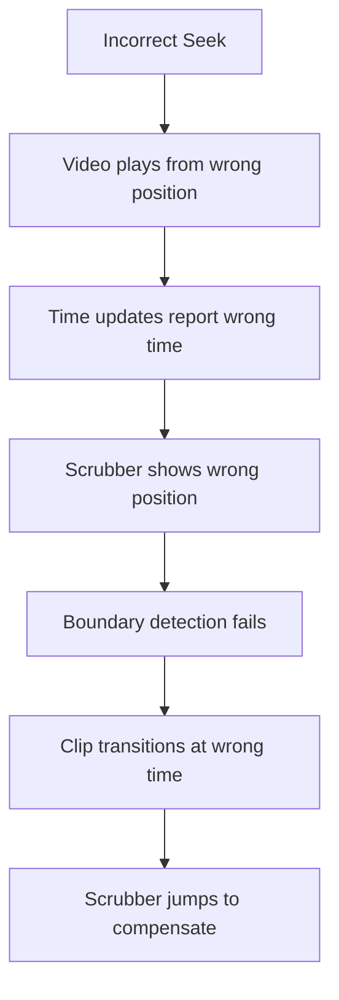

# Video Editor Scrubber Jumping - Root Cause Analysis

**Date:** 2025-08-22
**Time:** 03:30 AM EST
**Purpose:** Comprehensive analysis of scrubber jumping issues in video editor

## Executive Summary

The scrubber jumping issues are caused by **fundamental misunderstandings about how trimmed clips work**. The codebase incorrectly assumes that when playing a trimmed clip, the video element plays from `inPoint` to `outPoint` of the original video. In reality, the video element plays from `0` to `trimmedDuration`.

## The Core Problem

### What the Code Thinks Happens:
```
Original Video: [0 -------- 10 seconds --------]
Trimmed Clip:        [3 --- 7]  (inPoint=3, outPoint=7)
Video Element:       [3 --- 7]  ❌ WRONG ASSUMPTION
```

### What Actually Happens:
```
Original Video: [0 -------- 10 seconds --------]
Trimmed Clip:        [3 --- 7]  (inPoint=3, outPoint=7)
Video Element:  [0 --- 4]       ✅ REALITY (plays 0 to 4 seconds)
```

## Root Causes Identified

### 1. Incorrect Seek Calculation for Trimmed Clips

**Location:** `VideoEditorSingleton.ts` lines 419-425

**Current Code (WRONG):**
```typescript
const inPointFrame = frameService.timeToFrame(clip.inPoint)
const seekFrames = frameService.timeToFrame(playback.pendingSeek.time)
const targetFrame = inPointFrame + seekFrames  // ❌ Adding inPoint offset!
const seekTime = frameService.frameToTime(targetFrame)
await playbackService.seek(seekTime)
```

**Problem:** The code adds `inPoint` to the seek time, but the video element doesn't need this offset - it's already playing the trimmed segment starting from 0.

**Fix Needed:**
```typescript
// pendingSeek.time is already the correct local time within the clip
await playbackService.seek(playback.pendingSeek.time)  // No offset needed!
```

### 2. Incorrect Boundary Detection

**Location:** `VideoEditorSingleton.ts` lines 86-91

**Current Code (WRONG):**
```typescript
const currentFrame = frameService.timeToFrame(currentTime)  // Video element time (0-4)
const outPointFrame = frameService.timeToFrame(currentClip.outPoint)  // Original video time (7)
const hasReachedEnd = currentFrame >= outPointFrame  // ❌ Comparing incompatible values!
```

**Problem:** Comparing video element time (0-4) with original video outPoint (7). Will NEVER trigger!

**Fix Needed:**
```typescript
const trimmedDuration = currentClip.outPoint - currentClip.inPoint
const trimmedDurationFrame = frameService.timeToFrame(trimmedDuration)
const hasReachedEnd = currentFrame >= trimmedDurationFrame  // Compare apples to apples
```

### 3. Incorrect Scrubber Position Updates

**Location:** `VideoEditorMachineV5.ts` lines 443-456

**Current Code (WRONG):**
```typescript
scrubber: {
  ...context.timeline.scrubber,
  position: context.playback.activeClipStartTime + event.time
}
```

**Problem:** `event.time` is video element time (0-4), but it's being added to `activeClipStartTime` as if it were the full duration.

**Fix Needed:**
```typescript
// event.time is video element time, which corresponds to progress within the trimmed clip
position: context.playback.activeClipStartTime + event.time  // This is actually correct!
// BUT: activeClipStartTime calculation needs to account for trimmed duration
```

### 4. Split Clip Duration Confusion

**Location:** `VideoEditorMachineV5.ts` lines 957-972

**Current Code (MIXED):**
```typescript
const firstClip: TimelineClip = {
  ...clipToSplit,
  duration: splitPoint,  // ❌ Raw duration, not trimmed
  outPoint: clipToSplit.inPoint + splitPoint,  // ✅ Correct outPoint
}
```

**Problem:** The `duration` field stores the raw split duration, but `outPoint - inPoint` gives the trimmed duration. These don't match!

**Fix Needed:** Either:
- Option A: Make `duration` always equal `outPoint - inPoint`
- Option B: Keep `duration` as raw, but use `outPoint - inPoint` everywhere

## Why Console Logs Show Issues

### Log Pattern Analysis:

1. **"Clip ended at frame 13"** - This is the video element frame
2. **"outPointFrame: 13"** - This shows outPoint=0.433s (13 frames)
3. **"Immediate transition to next clip"** - Triggers correctly
4. **"Checking video reuse: sameBaseId: true"** - Tries to reuse same video
5. **"Processing clip transition: from same clip to same clip"** - Confusing!

The issue: Split clips share the same base video but have different trim points. The reuse logic doesn't account for this.

## The Cascade Effect



## Specific Examples from Logs

### Example 1: Split Clip Transition
```
🔪 SPLIT: Created clips at 0.433s
🎬 Reached clip end: currentFrame: 13, outPointFrame: 13  ✅ Correct
🎯 Immediate transition to next clip  ✅ Correct
🔄 Already playing correct clip, skipping load  ❌ WRONG! Different trim!
🎬 FRAME SEEK: Frame 13 (inPoint frame: 13 + seek frames: 0)  ❌ Double offset!
```

### Example 2: End of Timeline
```
🎯 End of timeline reached
🎬 At end of timeline (frame 118 >= 118), restarting from frame 0
🎯 Clearing stale state for restart from beginning
🔄 Switching from blob URL: [clip2] to: [clip1]  ✅ Correct
🎬 FRAME SEEK: Frame 0 (inPoint frame: 0 + seek frames: 0) = 0  ✅ Lucky! inPoint=0
```

## Critical Code Sections

### 1. VideoEditorSingleton.ts
- **Lines 86-91:** Boundary detection logic
- **Lines 419-425:** Seek calculation with inPoint offset
- **Lines 362-387:** Clip reuse logic

### 2. VideoEditorMachineV5.ts
- **Lines 443-456:** updateVideoTime action
- **Lines 957-972:** Split clip creation
- **Lines 284-289:** End of timeline detection

### 3. PlaybackService.ts
- **Lines 118-130:** Seek implementation
- **Lines 38-68:** Video loading logic

## The Solution Strategy

### Step 1: Fix Time Translation
Create a clear separation between:
- **Video Element Time:** 0 to (outPoint - inPoint)
- **Original Video Time:** inPoint to outPoint
- **Timeline Position:** startTime to (startTime + duration)

### Step 2: Fix Seek Logic
Remove the incorrect inPoint offset when seeking within trimmed clips.

### Step 3: Fix Boundary Detection
Use trimmed duration, not outPoint, for end detection.

### Step 4: Fix Clip Reuse
Check if clips have the same trim points, not just same source.

## Impact Assessment

### High Impact Issues (Causes Jumping):
1. ❌ Incorrect seek calculation
2. ❌ Wrong boundary detection
3. ❌ Clip reuse for different trims

### Medium Impact Issues (Causes Confusion):
1. ⚠️ Duration field inconsistency
2. ⚠️ Time update translations

### Low Impact Issues (Cosmetic):
1. ℹ️ Console log formatting
2. ℹ️ Variable naming

## Recommended Fix Order

1. **Fix seek calculation** - Remove inPoint offset (5 min)
2. **Fix boundary detection** - Use trimmed duration (5 min)
3. **Fix clip reuse logic** - Check trim points (10 min)
4. **Fix time updates** - Ensure consistent translation (10 min)
5. **Test thoroughly** - All split/trim scenarios (15 min)

## Test Cases to Verify Fix

1. **Single Split:** Record 10s → Split at 5s → Play through
2. **Multiple Splits:** Record 10s → Split at 3s, 6s → Play all
3. **Trim and Split:** Record → Trim to 5s → Split at 2s
4. **Seek in Split:** Split clip → Seek to middle of each part
5. **End of Timeline:** Play to end → Should restart at 0

## Conclusion

The root cause is a **fundamental misunderstanding of how video elements handle trimmed content**. The video element always plays from 0, regardless of the trim points. The codebase incorrectly tries to offset everything by inPoint, causing cascading calculation errors that manifest as scrubber jumping.

The fix is conceptually simple: Stop adding inPoint offsets where they don't belong, and use the correct duration (outPoint - inPoint) for boundary detection.