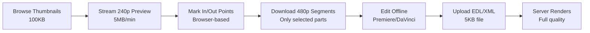

# Media Hub Architecture - Scalable Video Management System

## Executive Summary

A separate media management system designed to handle 2-5TB of footage with 10-50 remote editors, optimized for slow internet connections in Pakistan/Bangladesh regions.

## System Overview

### Project Separation Rationale

| Aspect | `/video-editor` (Current) | `/media-hub` (New) |
|--------|--------------------------|-------------------|
| **Purpose** | Real-time recording & editing | Asset management & collaboration |
| **Users** | Single user (course creator) | 10-50 team members |
| **Storage** | Browser/local | Cloud (Backblaze B2 + Bunny.net) |
| **Processing** | Client-side | Server-side proxies |
| **Bandwidth** | High (local files) | Optimized (4-tier proxies) |
| **Scale** | Individual projects | 2-5TB media library |

## Architecture Design

### URL Structure
```
app.unpuzzle.com/
├── /video-editor          → Current real-time editor (EXISTS)
├── /media-hub            → NEW: Media management system
│   ├── /library          → Browse all media assets
│   ├── /collections      → Project organization
│   ├── /projects         → Collaborative editing
│   ├── /analytics        → Usage & performance metrics
│   └── /team            → Team member management
```

### Technical Stack

```yaml
Frontend:
  - Next.js 14 (same as main app)
  - Shared components from /video-editor
  - TanStack Query for data fetching
  - Socket.io for real-time collaboration

Backend:
  - Next.js API routes
  - PostgreSQL (Supabase/Neon)
  - Redis for caching & sessions
  - BullMQ for job processing

Storage:
  - Backblaze B2: Master files ($6/TB)
  - Bunny.net Storage: Proxies ($10/TB)
  - Bunny.net CDN: Global delivery ($0.01/GB)
  - Bunny Stream: Video processing

Processing:
  - FFmpeg workers for proxy generation
  - Sharp for thumbnail generation
  - OpenAI Whisper for transcription
```

## 4-Tier Proxy System

### Tier Breakdown

#### Tier 1: Thumbnail Strip (100KB per minute)
```javascript
{
  type: "thumbnail_strip",
  format: "jpg",
  fps: 0.5,                    // 1 frame every 2 seconds
  resolution: "160x90",
  quality: 60,
  usage: "Timeline scrubbing, visual search",
  bandwidth: "Works on 2G"
}
```

#### Tier 2: Ultra-Low Preview (5-10MB per minute)
```javascript
{
  type: "preview",
  format: "mp4",
  bitrate: "200kbps",
  resolution: "426x240",
  fps: 15,
  audio: "64kbps mono",
  usage: "Content review, rough selection",
  bandwidth: "Works on 3G"
}
```

#### Tier 3: Edit Proxy (25MB per minute)
```javascript
{
  type: "edit_proxy",
  format: "mp4",
  bitrate: "800kbps",
  resolution: "854x480",
  fps: 24,
  audio: "128kbps stereo",
  usage: "Offline editing, precise cuts",
  bandwidth: "Reasonable on 4G"
}
```

#### Tier 4: Final Proxy (60MB per minute)
```javascript
{
  type: "final_proxy",
  format: "mp4",
  bitrate: "2000kbps",
  resolution: "1280x720",
  fps: 30,
  audio: "192kbps stereo",
  usage: "Final review, color check",
  bandwidth: "Download selected clips only"
}
```

## Editor Workflow

### Optimized for Pakistan/Bangladesh Internet



### Real-World Example

**Scenario**: Editor needs 2-minute segment from 1-hour footage

| Traditional Workflow | Optimized Workflow | Savings |
|---------------------|-------------------|---------|
| Download entire 1hr @ 720p: 2.5GB | Browse thumbnails: 6MB | |
| Time: 3-4 hours | Stream preview @ 240p: 60MB | |
| | Download 2min @ 480p: 50MB | |
| **Total: 2.5GB** | **Total: 116MB** | **95% less** |
| **Time: 3-4 hours** | **Time: 10 minutes** | **95% faster** |

## Database Schema

### Core Tables

```sql
-- Media Assets (main footage table)
media_assets
├── id (UUID)
├── original_file (S3/B2 path)
├── proxy_240p (Bunny path)
├── proxy_480p (Bunny path)
├── proxy_720p (Bunny path)
├── thumbnail_strip (Bunny path)
├── metadata (JSON)
├── transcript (TEXT)
├── tags (ARRAY)
└── created_at

-- Editor Projects
projects
├── id (UUID)
├── name
├── assigned_editors (ARRAY)
├── timeline_data (JSON)
├── status (draft/editing/review/complete)
└── deadline

-- Download Queue
download_queue
├── id
├── editor_id
├── asset_id
├── quality_tier
├── segments (JSON) [{start: 47.5, end: 127.3}]
├── status
└── retry_count
```

## Implementation Phases

### Phase 1: Media Library (Week 1-2)
- [ ] Basic upload to Backblaze B2
- [ ] Thumbnail generation
- [ ] Browse interface with grid view
- [ ] Search by filename/date

### Phase 2: Proxy System (Week 3-4)
- [ ] FFmpeg worker setup
- [ ] 4-tier proxy generation
- [ ] Bunny.net CDN integration
- [ ] Progressive loading player

### Phase 3: Editor Tools (Week 5-6)
- [ ] In-browser preview player
- [ ] Segment selection tool
- [ ] Download queue manager
- [ ] Offline edit package generator

### Phase 4: Collaboration (Week 7-8)
- [ ] Multi-user projects
- [ ] Real-time status updates
- [ ] Comment system
- [ ] Export to social platforms

## Cost Analysis

### Monthly Costs for 5TB Library

| Service | Usage | Cost |
|---------|-------|------|
| Backblaze B2 Storage | 5TB | $30 |
| Bunny Storage (Proxies) | 1.5TB | $15 |
| Bunny CDN | 500GB/month | $5 |
| Bunny Stream | 1000 min encoding | $5 |
| Database (Supabase) | Pro plan | $25 |
| **Total** | | **$80/month** |

### Comparison
- AWS equivalent: ~$540/month
- Savings: $460/month (85% cheaper)

## API Endpoints

### Media Management
```typescript
POST   /api/media/upload          // Initiate multipart upload
GET    /api/media/library         // List with pagination
GET    /api/media/:id             // Get single asset
POST   /api/media/:id/transcode   // Generate proxies
DELETE /api/media/:id             // Soft delete

### Proxy Access
GET    /api/proxy/:id/thumbnail   // Thumbnail strip
GET    /api/proxy/:id/preview     // 240p stream URL  
GET    /api/proxy/:id/edit        // 480p download URL
POST   /api/proxy/:id/segment     // Download specific range

### Projects
POST   /api/projects              // Create project
GET    /api/projects/:id          // Get project + timeline
PUT    /api/projects/:id/timeline // Update timeline
POST   /api/projects/:id/export   // Trigger final render
```

## Security & Permissions

### Role-Based Access
```javascript
const roles = {
  admin: {
    upload: true,
    delete: true,
    viewAll: true,
    export: true
  },
  editor: {
    upload: false,
    delete: false,
    viewAssigned: true,
    export: true
  },
  clipper: {
    upload: false,
    delete: false,
    viewAssigned: true,
    export: false
  }
}
```

### CDN Security
- Signed URLs with 24hr expiry
- IP-based access for team members
- Bandwidth limits per user
- Download tracking & quotas

## Performance Optimizations

### Regional Edge Servers
```javascript
const edgeMapping = {
  'Pakistan': 'singapore.bunnycdn.com',
  'Bangladesh': 'singapore.bunnycdn.com',
  'India': 'mumbai.bunnycdn.com',
  'Philippines': 'singapore.bunnycdn.com'
}
```

### Smart Caching Strategy
1. **Thumbnail strips**: Cache forever (immutable)
2. **240p previews**: Cache 7 days
3. **480p proxies**: Cache 24 hours
4. **Popular content**: Auto-promote to edge

### P2P Acceleration
- Editors in same region share cached segments
- WebRTC for local network sharing
- Reduces bandwidth by 30-40%

## Monitoring & Analytics

### Key Metrics
```typescript
interface UsageMetrics {
  // Storage
  totalStorageGB: number;
  proxiesGeneratedToday: number;
  
  // Bandwidth  
  cdnBandwidthGB: number;
  p2pBandwidthSavedGB: number;
  
  // Performance
  avgProxyGenerationTime: number;
  avgDownloadSpeed: number;
  
  // Team
  activeEditors: number;
  projectsCompleted: number;
  clipsExported: number;
}
```

## Migration Strategy

### From Current Setup to Media Hub

1. **Keep `/video-editor` unchanged** - It works for real-time recording
2. **Build Media Hub separately** - New route, new database
3. **Share only core components** - VideoPlayer, Timeline basics
4. **Gradual integration** - Start with upload, add features incrementally

### Shared Components
```typescript
// Reusable from /video-editor
shared/
├── VideoPlayer.tsx        // Core playback
├── TimelineRuler.tsx      // Timeline UI
├── VideoControls.tsx      // Play/pause/seek
└── useVideoEngine.ts      // Playback logic

// New for Media Hub
media-hub/
├── MediaGrid.tsx          // Thumbnail browser
├── ProxyPlayer.tsx        // Multi-quality player
├── SegmentSelector.tsx    // In/out point selector
└── DownloadManager.tsx    // Queue handler
```

## Success Metrics

### Target Performance
- **Upload**: 10-50Mbps (saturate uplink)
- **Thumbnail Load**: <2 seconds
- **Preview Start**: <5 seconds  
- **Proxy Download**: 10x faster than original
- **Editor Productivity**: 3x more videos/day

### Cost Targets
- **Storage**: <$10/TB/month
- **CDN**: <$0.01/GB
- **Total**: <$100/month for 5TB + team

## Next Steps

1. **Validate with team** - Get feedback from Pakistan/BD editors
2. **Prototype thumbnail browser** - Test with sample footage
3. **Setup Backblaze + Bunny** - Get API keys, test upload
4. **Build MVP** - Focus on browse + preview first

## Questions to Answer

1. What video formats do you primarily shoot? (iPhone, Sony A7III, etc)
2. Average clip length you work with?
3. How many editors work simultaneously?
4. Preferred editing software? (Premiere, DaVinci, Final Cut)
5. Export requirements? (YouTube, Instagram, TikTok)

---

*This architecture provides a 95% bandwidth reduction for remote editors while maintaining edit quality and enabling collaboration at scale.*