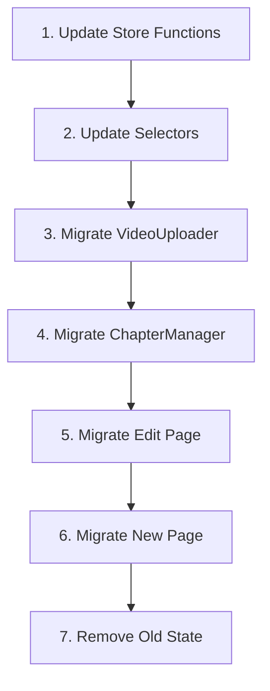

# Complete Old State Removal - Full Migration to Normalized State

## Executive Summary
This plan provides a comprehensive strategy to completely remove the old denormalized state and fully commit to the normalized state architecture. No more dual-state synchronization, no more bugs from state mismatches - just clean, normalized state throughout.

## ⚠️ CRITICAL: Pre-Migration Checklist
Before starting ANY migration work, ensure:
- [ ] Full backup of current working state
- [ ] All current features documented and tested
- [ ] Rollback branch created: `git checkout -b pre-normalized-migration-backup`
- [ ] Development environment ready for testing
- [ ] No pending user data or unsaved changes

## Phase 1: Complete State Mapping (2-4 hours)
**Goal:** Map EVERY usage of old state to its normalized equivalent

### 1.1 Old State Structure to Remove
```typescript
// OLD STATE (to be completely removed)
interface CourseCreationSlice {
  courseCreation: CourseCreationData | null  // ❌ REMOVE
  uploadQueue: VideoUpload[]                 // ❌ REMOVE
  isAutoSaving: boolean                      // ✅ KEEP (UI state)
  currentStep: string                        // ✅ KEEP (UI state)
}
```

### 1.2 New Normalized State Structure
```typescript
// NEW NORMALIZED STATE (single source of truth)
interface NormalizedCourseSlice {
  // Core normalized data
  normalizedState: {
    videos: Record<string, NormalizedVideo>
    chapters: Record<string, NormalizedChapter>
    courses: Record<string, NormalizedCourse>
  }
  
  // UI state (keep separate from data)
  uiState: {
    isAutoSaving: boolean
    currentStep: 'info' | 'content' | 'review'
    activeCourseId: string | null
    uploadProgress: Record<string, number>
  }
  
  // Temporary state for uploads
  uploadQueue: NormalizedVideoUpload[]  // Normalized version
}
```

### 1.3 Complete Function Migration Map

| Old Function | New Function | Breaking Changes |
|-------------|--------------|------------------|
| `setCourseInfo()` | `updateNormalizedCourse()` | Parameter structure |
| `addVideosToQueue()` | `addVideosToNormalizedQueue()` | Returns video IDs |
| `updateVideoProgress()` | `updateNormalizedVideoProgress()` | None |
| `updateVideoStatus()` | `updateNormalizedVideoStatus()` | Status enum values |
| `updateVideoName()` | `updateNormalizedVideo()` | Merged into single update |
| `removeVideo()` | `markVideoForDeletion()` | Only marks, doesn't remove |
| `createChapter()` | `createNormalizedChapter()` | Returns chapter ID |
| `updateChapter()` | `updateNormalizedChapter()` | None |
| `deleteChapter()` | `deleteNormalizedChapter()` | Cascades to videos |
| `reorderChapters()` | `reorderNormalizedChapters()` | Takes IDs not objects |
| `moveVideoToChapter()` | `updateVideoChapter()` | None |
| `reorderVideosInChapter()` | `reorderNormalizedVideos()` | Takes IDs not objects |
| `moveVideoBetweenChapters()` | `moveNormalizedVideo()` | Simplified parameters |
| `saveDraft()` | `saveNormalizedDraft()` | Different data structure |
| `publishCourse()` | `publishNormalizedCourse()` | Different data structure |
| `loadCourseForEdit()` | `loadNormalizedCourse()` | Returns normalized data |

## Phase 2: Critical Path Components (Must migrate first)

### 2.1 Components Currently Using Old State

**High Priority (Core functionality):**
1. `/src/app/instructor/course/[id]/edit/page.tsx` - Course editor
2. `/src/app/instructor/course/new/page.tsx` - Course creation
3. `/src/components/course/ChapterManager.tsx` - Chapter management
4. `/src/components/course/VideoUploader.tsx` - Video uploads

**Medium Priority (Supporting features):**
5. `/src/stores/slices/course-creation-slice.ts` - State management

**Low Priority (Can be deprecated):**
6. `/src/app/instructor/course/[id]/edit/page-old.tsx` - Old backup
7. `/src/app/instructor/course/new/page-old.tsx` - Old backup

### 2.2 Migration Order (Critical Path)


## Phase 3: Store Migration (Day 1)

### 3.1 Create New Normalized Store Functions
```typescript
// /src/stores/slices/normalized-course-slice.ts

export const createNormalizedCourseSlice = (set, get) => ({
  normalizedState: {
    videos: {},
    chapters: {},
    courses: {}
  },
  
  uiState: {
    isAutoSaving: false,
    currentStep: 'info',
    activeCourseId: null,
    uploadProgress: {}
  },
  
  uploadQueue: [],
  
  // Video Operations (no more dual state!)
  addVideosToNormalizedQueue: (files: FileList) => {
    const videos: NormalizedVideo[] = Array.from(files).map(file => ({
      id: generateId(),
      title: file.name,
      file,
      status: 'pending',
      order: 0,
      chapterId: null,
      courseId: get().uiState.activeCourseId,
      markedForDeletion: false
    }))
    
    set(state => ({
      normalizedState: {
        ...state.normalizedState,
        videos: {
          ...state.normalizedState.videos,
          ...videos.reduce((acc, v) => ({ ...acc, [v.id]: v }), {})
        }
      },
      uploadQueue: [...state.uploadQueue, ...videos]
    }))
    
    return videos.map(v => v.id)
  },
  
  markVideoForDeletion: (videoId: string) => {
    // SINGLE update location - no more sync issues!
    set(state => ({
      normalizedState: {
        ...state.normalizedState,
        videos: {
          ...state.normalizedState.videos,
          [videoId]: {
            ...state.normalizedState.videos[videoId],
            markedForDeletion: true
          }
        }
      }
    }))
  },
  
  reorderNormalizedVideos: (videoIds: string[]) => {
    // Update order field directly - single source of truth
    set(state => ({
      normalizedState: {
        ...state.normalizedState,
        videos: videoIds.reduce((acc, id, index) => ({
          ...acc,
          [id]: {
            ...state.normalizedState.videos[id],
            order: index
          }
        }), state.normalizedState.videos)
      }
    }))
  },
  
  // Save with ONLY normalized state
  saveNormalizedDraft: async () => {
    const state = get()
    const { normalizedState, uiState } = state
    
    // Get videos marked for deletion from SINGLE source
    const videosToDelete = Object.values(normalizedState.videos)
      .filter(v => v.markedForDeletion)
    
    // Process deletions
    if (videosToDelete.length > 0) {
      await Promise.all(videosToDelete.map(v => 
        deleteVideoFromBackend(v.id)
      ))
    }
    
    // Save normalized state
    const courseData = denormalizeForSave(normalizedState, uiState.activeCourseId)
    await saveCourseToBackend(courseData)
  }
})
```

### 3.2 Create Denormalization Helpers
```typescript
// /src/stores/helpers/denormalize.ts

export function denormalizeForSave(
  state: NormalizedState, 
  courseId: string
): CourseData {
  const course = state.courses[courseId]
  if (!course) throw new Error('Course not found')
  
  return {
    ...course,
    chapters: course.chapterIds
      .map(id => state.chapters[id])
      .filter(Boolean)
      .sort((a, b) => a.order - b.order)
      .map(chapter => ({
        ...chapter,
        videos: chapter.videoIds
          .map(id => state.videos[id])
          .filter(v => !v.markedForDeletion)
          .sort((a, b) => a.order - b.order)
      }))
  }
}

export function normalizeFromBackend(courseData: any): NormalizedState {
  const videos: Record<string, NormalizedVideo> = {}
  const chapters: Record<string, NormalizedChapter> = {}
  
  courseData.chapters?.forEach((chapter: any, chapterIndex: number) => {
    const chapterVideoIds: string[] = []
    
    chapter.videos?.forEach((video: any, videoIndex: number) => {
      videos[video.id] = {
        ...video,
        order: videoIndex,
        chapterId: chapter.id,
        courseId: courseData.id,
        markedForDeletion: false
      }
      chapterVideoIds.push(video.id)
    })
    
    chapters[chapter.id] = {
      ...chapter,
      order: chapterIndex,
      videoIds: chapterVideoIds,
      courseId: courseData.id
    }
  })
  
  return {
    videos,
    chapters,
    courses: {
      [courseData.id]: {
        ...courseData,
        chapterIds: Object.keys(chapters)
      }
    }
  }
}
```

## Phase 4: Component Migration (Day 2-3)

### 4.1 VideoUploader Component Migration
```typescript
// /src/components/course/VideoUploader.tsx

// BEFORE (old state)
const { addVideosToQueue, uploadQueue } = useAppStore()

// AFTER (normalized state)  
const { 
  addVideosToNormalizedQueue,
  uploadQueue,
  normalizedState 
} = useAppStore()

const handleUpload = (files: FileList) => {
  // Old way - REMOVE
  // addVideosToQueue(files)
  
  // New way - normalized
  const videoIds = addVideosToNormalizedQueue(files)
  // Process uploads using IDs
}
```

### 4.2 ChapterManager Component Migration
```typescript
// /src/components/course/ChapterManager.tsx

// BEFORE
const { courseCreation, reorderVideosInChapter } = useAppStore()
const chapters = courseCreation?.chapters || []

// AFTER
const { normalizedState, reorderNormalizedVideos } = useAppStore()
const chapters = useAppStore(state => 
  getChaptersForCourse(state.normalizedState, state.uiState.activeCourseId)
)

const handleReorder = (videoIds: string[]) => {
  // Single source of truth for order!
  reorderNormalizedVideos(videoIds)
}
```

### 4.3 Course Edit Page Migration
```typescript
// /src/app/instructor/course/[id]/edit/page.tsx

// BEFORE
const courseCreation = useAppStore(state => state.courseCreation)
const saveDraft = useAppStore(state => state.saveDraft)

// AFTER  
const course = useAppStore(state => 
  state.normalizedState.courses[state.uiState.activeCourseId]
)
const saveNormalizedDraft = useAppStore(state => state.saveNormalizedDraft)

// Component now uses normalized selectors
const videos = useAppStore(state => 
  getVideosForCourse(state.normalizedState, state.uiState.activeCourseId)
)
```

## Phase 5: Selector Creation (Day 2)

### 5.1 Essential Selectors
```typescript
// /src/stores/selectors/normalized-selectors.ts

export const getVideosForCourse = (
  state: NormalizedState, 
  courseId: string
): NormalizedVideo[] => {
  return Object.values(state.videos)
    .filter(v => v.courseId === courseId && !v.markedForDeletion)
    .sort((a, b) => a.order - b.order)
}

export const getVideosForChapter = (
  state: NormalizedState,
  chapterId: string  
): NormalizedVideo[] => {
  return Object.values(state.videos)
    .filter(v => v.chapterId === chapterId && !v.markedForDeletion)
    .sort((a, b) => a.order - b.order)
}

export const getChaptersForCourse = (
  state: NormalizedState,
  courseId: string
): NormalizedChapter[] => {
  return Object.values(state.chapters)
    .filter(c => c.courseId === courseId)
    .sort((a, b) => a.order - b.order)
}

export const getVideoById = (
  state: NormalizedState,
  videoId: string
): NormalizedVideo | null => {
  return state.videos[videoId] || null
}

export const getPendingUploads = (
  state: NormalizedState
): NormalizedVideo[] => {
  return Object.values(state.videos)
    .filter(v => v.status === 'pending' || v.status === 'uploading')
}

export const getVideosMarkedForDeletion = (
  state: NormalizedState
): NormalizedVideo[] => {
  return Object.values(state.videos)
    .filter(v => v.markedForDeletion === true)
}
```

## Phase 6: Critical Edge Cases to Handle

### 6.1 Video Upload Flow
```typescript
// CRITICAL: Maintain upload progress during migration
const uploadVideo = async (video: NormalizedVideo) => {
  // Update progress in normalized state
  updateNormalizedVideoProgress(video.id, 0)
  
  try {
    const result = await uploadToBackend(video.file)
    updateNormalizedVideo(video.id, {
      url: result.url,
      status: 'ready'
    })
  } catch (error) {
    updateNormalizedVideo(video.id, {
      status: 'error',
      error: error.message
    })
  }
}
```

### 6.2 Auto-Save Handling
```typescript
// CRITICAL: Don't lose auto-save functionality
let autoSaveTimer: NodeJS.Timeout | null = null

const triggerAutoSave = () => {
  if (autoSaveTimer) clearTimeout(autoSaveTimer)
  
  autoSaveTimer = setTimeout(() => {
    saveNormalizedDraft()
  }, 2000)
}

// Hook into all mutations
const wrapMutation = (fn: Function) => {
  return (...args: any[]) => {
    const result = fn(...args)
    if (get().uiState.isAutoSaving) {
      triggerAutoSave()
    }
    return result
  }
}
```

### 6.3 Course Loading
```typescript
// CRITICAL: Convert backend data to normalized on load
const loadNormalizedCourse = async (courseId: string) => {
  const courseData = await fetchCourseFromBackend(courseId)
  const normalized = normalizeFromBackend(courseData)
  
  set({
    normalizedState: normalized,
    uiState: {
      ...get().uiState,
      activeCourseId: courseId
    }
  })
}
```

## Phase 7: Testing Strategy

### 7.1 Critical User Flows to Test
1. **Video Upload → Reorder → Save**
   - Upload 3 videos
   - Drag to reorder
   - Save and reload
   - ✅ Order must persist

2. **Video Deletion → Save**
   - Mark video for deletion
   - Save changes
   - ✅ Video removed from backend
   - ✅ Video removed from UI

3. **Chapter Creation → Add Videos → Save**
   - Create new chapter
   - Add videos to chapter
   - Reorder within chapter
   - Save and reload
   - ✅ Structure persists

4. **Cross-Chapter Video Move**
   - Move video from Chapter A to Chapter B
   - Save
   - ✅ Video in correct chapter after reload

5. **Auto-Save During Edits**
   - Enable auto-save
   - Make rapid changes
   - ✅ Changes persist without manual save

### 7.2 Edge Cases to Verify
- [ ] Empty course (no chapters, no videos)
- [ ] Course with chapters but no videos
- [ ] Course with videos but no chapters
- [ ] Simultaneous video uploads (5+)
- [ ] Network failure during save
- [ ] Browser refresh during upload
- [ ] Deleting chapter with videos
- [ ] Moving last video out of chapter

## Phase 8: Rollback Plan

### 8.1 Emergency Rollback Steps
If critical issues arise:

```bash
# 1. Stop all work immediately
git stash

# 2. Switch to backup branch
git checkout pre-normalized-migration-backup

# 3. Deploy hotfix if needed
git cherry-pick <critical-fix-commit>

# 4. Document what broke
echo "Failed at: [component/function]" >> migration-issues.log
```

### 8.2 Partial Rollback Strategy
If only specific components break:

```typescript
// Temporary compatibility wrapper
export const useCompatibleStore = () => {
  const store = useAppStore()
  
  // If new state works, use it
  if (store.normalizedState?.courses) {
    return {
      course: store.normalizedState.courses[store.uiState.activeCourseId],
      saveDraft: store.saveNormalizedDraft
    }
  }
  
  // Fallback to old state (emergency only!)
  return {
    course: store.courseCreation,
    saveDraft: store.saveDraft
  }
}
```

## Phase 9: Final Cleanup (Day 4)

### 9.1 Remove Old State Completely
```typescript
// /src/stores/slices/course-creation-slice.ts

// DELETE THIS ENTIRE SECTION
- courseCreation: null,
- uploadQueue: [],
- setCourseInfo: () => {},
- addVideosToQueue: () => {},
// ... all old functions

// KEEP ONLY normalized functions
+ normalizedState: {},
+ addVideosToNormalizedQueue: () => {},
+ saveNormalizedDraft: () => {},
// ... only new functions
```

### 9.2 Delete Obsolete Files
```bash
# Remove old backup files
rm src/app/instructor/course/[id]/edit/page-old.tsx
rm src/app/instructor/course/new/page-old.tsx

# Remove old type definitions
rm src/types/course-creation.ts  # if separate

# Remove old selectors
rm src/stores/selectors/course-selectors.ts  # if old
```

### 9.3 Update Imports
```typescript
// Global search and replace
- import { CourseCreationSlice } from '@/stores/slices/course-creation-slice'
+ import { NormalizedCourseSlice } from '@/stores/slices/normalized-course-slice'

- import { getCourseVideos } from '@/stores/selectors/course-selectors'  
+ import { getVideosForCourse } from '@/stores/selectors/normalized-selectors'
```

## Implementation Timeline

### Day 1 (8 hours)
- **Morning (4h):** Create normalized store functions and helpers
- **Afternoon (4h):** Create selectors and test in isolation

### Day 2 (8 hours)
- **Morning (4h):** Migrate VideoUploader and ChapterManager
- **Afternoon (4h):** Migrate Course Edit page

### Day 3 (8 hours)
- **Morning (4h):** Migrate Course New page
- **Afternoon (4h):** Complete testing of all flows

### Day 4 (4 hours)
- **Morning (2h):** Remove old state
- **Final (2h):** Cleanup and documentation

## Success Metrics

### Must Pass (Day 3)
- [ ] Video reordering works and persists
- [ ] Video deletion works completely
- [ ] All CRUD operations functional
- [ ] No console errors
- [ ] Auto-save works

### Should Pass (Day 4)
- [ ] All old state removed
- [ ] No references to courseCreation
- [ ] All components use normalized state
- [ ] Clean TypeScript compilation
- [ ] Performance improved

### Nice to Have (Future)
- [ ] 100% TypeScript coverage
- [ ] Unit tests for all selectors
- [ ] E2E tests for critical flows
- [ ] Performance monitoring added

## Critical Warnings

### ⚠️ DO NOT:
- Start migration without backup branch
- Delete old state before ALL components migrated
- Skip testing after each component migration
- Migrate during active user hours
- Ignore TypeScript errors (use `as any` temporarily)

### ✅ ALWAYS:
- Test each component after migration
- Keep console open for errors
- Commit after each successful migration
- Document any unexpected issues
- Have rollback plan ready

## Post-Migration Verification

### Final Checklist
```bash
# 1. Search for old state references (should return 0)
grep -r "courseCreation" src/
grep -r "uploadQueue\[" src/  # array access pattern

# 2. Verify TypeScript compilation
npm run build

# 3. Run tests if available
npm test

# 4. Check bundle size (should be smaller)
npm run analyze

# 5. Test all user flows manually
# - Create new course
# - Edit existing course  
# - Upload, reorder, delete videos
# - Publish course
```

## Conclusion

This migration plan completely removes the old denormalized state and commits fully to the normalized architecture. Key benefits:

1. **No more dual-state bugs** - Single source of truth
2. **Cleaner codebase** - Remove ~40% of state management code
3. **Better performance** - No redundant updates
4. **Easier debugging** - One place to look for issues
5. **Future-proof** - Easier to add new features

Start with Phase 1 (store migration) and proceed methodically. The careful approach ensures the app never breaks for users while you migrate.

**Remember:** One component at a time, test everything, keep the old state until you're 100% sure the new state works everywhere.