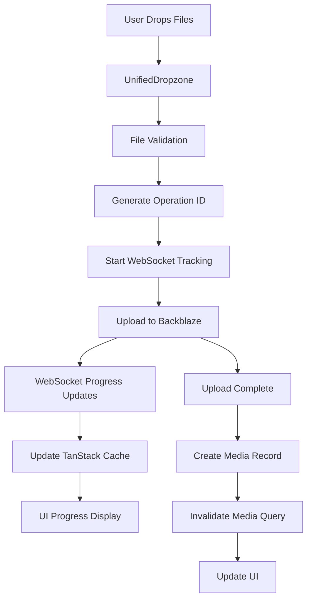
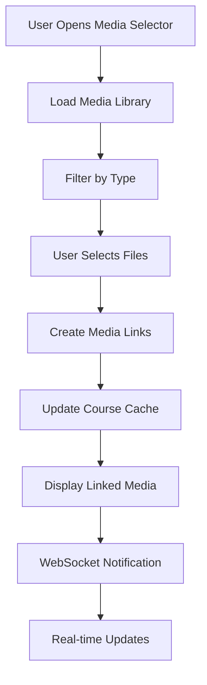

# Media Library Integration Implementation Plan

## Executive Summary

This document provides a comprehensive implementation plan for integrating the media library with existing course creation components and features. The plan addresses the current issues with SimpleUpload drag/drop reliability, lack of integration between media library and course pages, and the need for unified media selection across all workflows.

## Current State Analysis

### Current Working Features
- ✅ WebSocket progress tracking system with real-time updates
- ✅ TanStack Query for server state management
- ✅ Backblaze upload service with signed URLs
- ✅ Course creation/editing workflows with chapter management
- ✅ Video upload components in course editing pages
- ✅ Media library page with basic file management

### Current Issues
- ❌ SimpleUpload drag/drop doesn't work reliably
- ❌ No integration between media library and course pages
- ❌ Course creation still uses separate upload components
- ❌ No unified media selection across workflows
- ❌ Duplicated upload logic between media and course components

### Current Upload Components Architecture

#### Course Upload Components
1. **VideoUploader** (`/src/components/course/VideoUploader.tsx`)
   - Basic drag/drop with native HTML5 APIs
   - Compact mode for edit pages
   - Direct file selection via hidden input
   - Issues: Basic implementation, no progress tracking

2. **ChapterManager Upload** (`/src/app/instructor/course/[id]/edit/page.tsx`)
   - Integrated with chapter management
   - Uses `handleVideoUpload` function
   - WebSocket progress tracking enabled
   - TanStack Query integration for optimistic updates

#### Media Library Components  
3. **SimpleUpload** (`/src/components/media/simple-upload.tsx`)
   - Basic drag/drop implementation
   - TanStack Query mutation for uploads
   - Issues: Drag/drop unreliable, no progress tracking
   - No connection to course workflows

4. **Media Library Page** (`/src/app/instructor/media/page.tsx`)
   - File management interface
   - Search and filter capabilities
   - No "Browse from Library" functionality for course creation

### WebSocket Integration Points

The system has robust WebSocket integration for real-time progress tracking:

1. **Course WebSocket Hook** (`/src/hooks/use-course-websocket.ts`)
   - Operation tracking with timeout handling
   - Real-time progress updates
   - Cache invalidation coordination

2. **Video Upload Hook** (`/src/hooks/use-video-queries.ts`)
   - Optimistic updates with temporary video objects
   - WebSocket operation ID tracking
   - TanStack Query cache management

3. **WebSocket Operations** (`/src/lib/websocket-operations.ts`)
   - Operation ID generation
   - Event coordination

## Integration Architecture Plan

### Core Design Principles

1. **Unified Upload Interface**: Replace all upload components with react-dropzone
2. **Media Library First**: All uploads go through media library, then link to courses
3. **Progressive Enhancement**: Maintain existing functionality while adding new features
4. **Architecture Compliance**: Follow established TanStack Query + Zustand patterns
5. **WebSocket Continuity**: Preserve existing progress tracking system

### Component Hierarchy

```
MediaLibraryIntegration/
├── UnifiedDropzone (react-dropzone wrapper)
├── MediaSelector (browse library modal)
├── MediaUploadProgress (WebSocket progress display)
└── MediaLinkManager (link media to courses)

CourseIntegration/
├── CourseMediaSelector (enhanced chapter upload)
├── MediaLibraryButton (browse library trigger)
└── LinkedMediaDisplay (show linked media)
```

## Step-by-Step Implementation Strategy

### Phase 1: Foundation Components (Week 1)

#### 1.1 Install Dependencies
```bash
npm install react-dropzone @types/react-dropzone
```

#### 1.2 Create UnifiedDropzone Component
**File: `/src/components/media/unified-dropzone.tsx`**

```typescript
"use client"

import { useCallback } from 'react'
import { useDropzone } from 'react-dropzone'
import { Button } from '@/components/ui/button'
import { Upload, FileVideo, Image, File } from 'lucide-react'
import { cn } from '@/lib/utils'

interface UnifiedDropzoneProps {
  onFilesAccepted: (files: File[]) => void
  accept?: Record<string, string[]>
  maxFiles?: number
  maxSize?: number
  disabled?: boolean
  className?: string
  compact?: boolean
  children?: React.ReactNode
}

export function UnifiedDropzone({
  onFilesAccepted,
  accept = {
    'video/*': ['.mp4', '.mov', '.avi', '.mkv'],
    'image/*': ['.jpg', '.jpeg', '.png', '.gif'],
    'application/*': ['.pdf', '.doc', '.docx']
  },
  maxFiles = 10,
  maxSize = 500 * 1024 * 1024, // 500MB
  disabled = false,
  className,
  compact = false,
  children
}: UnifiedDropzoneProps) {
  const onDrop = useCallback((acceptedFiles: File[]) => {
    onFilesAccepted(acceptedFiles)
  }, [onFilesAccepted])

  const { getRootProps, getInputProps, isDragActive, isDragReject } = useDropzone({
    onDrop,
    accept,
    maxFiles,
    maxSize,
    disabled,
    multiple: true
  })

  if (compact) {
    return (
      <Button
        {...getRootProps()}
        variant="outline"
        disabled={disabled}
        className={cn(
          "relative cursor-pointer",
          isDragActive && "border-primary bg-accent",
          isDragReject && "border-destructive",
          className
        )}
      >
        <input {...getInputProps()} />
        <Upload className="mr-2 h-4 w-4" />
        {children || 'Upload Files'}
      </Button>
    )
  }

  return (
    <div
      {...getRootProps()}
      className={cn(
        "border-2 border-dashed rounded-lg p-8 text-center transition-colors cursor-pointer",
        "hover:border-primary hover:bg-accent/50",
        isDragActive && "border-primary bg-accent/50 scale-105",
        isDragReject && "border-destructive bg-destructive/10",
        disabled && "opacity-50 cursor-not-allowed",
        className
      )}
    >
      <input {...getInputProps()} />
      <Upload className="mx-auto h-12 w-12 text-muted-foreground mb-4" />
      {isDragActive ? (
        <p className="text-lg font-medium">Drop files here...</p>
      ) : (
        <>
          <p className="text-lg font-medium mb-2">
            Drag & drop files here, or click to browse
          </p>
          <p className="text-sm text-muted-foreground mb-4">
            Support for videos, images, and documents up to {maxSize / (1024 * 1024)}MB
          </p>
          {children}
        </>
      )}
    </div>
  )
}
```

#### 1.3 Create MediaUploadProgress Component
**File: `/src/components/media/media-upload-progress.tsx`**

```typescript
"use client"

import { useEffect, useState } from 'react'
import { Card, CardContent, CardHeader, CardTitle } from '@/components/ui/card'
import { Progress } from '@/components/ui/progress'
import { Button } from '@/components/ui/button'
import { Badge } from '@/components/ui/badge'
import { CheckCircle, XCircle, Upload, X } from 'lucide-react'
import { useWebSocketConnection } from '@/hooks/use-websocket-connection'
import { useAuth } from '@/hooks/use-auth'

interface UploadItem {
  id: string
  file: File
  progress: number
  status: 'uploading' | 'completed' | 'error'
  error?: string
  mediaId?: string
}

interface MediaUploadProgressProps {
  uploads: UploadItem[]
  onRemove: (id: string) => void
  onClose?: () => void
  className?: string
}

export function MediaUploadProgress({
  uploads,
  onRemove,
  onClose,
  className
}: MediaUploadProgressProps) {
  const { userId } = useAuth()
  const websocket = useWebSocketConnection(userId || '')
  
  useEffect(() => {
    if (!websocket.isConnected) return

    const handleProgress = (data: any) => {
      // Handle WebSocket progress updates
      // Will integrate with existing WebSocket system
    }

    websocket.on('media_upload_progress', handleProgress)
    return () => websocket.off('media_upload_progress', handleProgress)
  }, [websocket])

  if (uploads.length === 0) return null

  const completedCount = uploads.filter(u => u.status === 'completed').length
  const errorCount = uploads.filter(u => u.status === 'error').length
  const uploadingCount = uploads.filter(u => u.status === 'uploading').length

  return (
    <Card className={className}>
      <CardHeader className="pb-3">
        <div className="flex items-center justify-between">
          <CardTitle className="text-lg">Upload Progress</CardTitle>
          <div className="flex items-center gap-2">
            <Badge variant="secondary">{uploads.length} files</Badge>
            {onClose && (
              <Button variant="ghost" size="sm" onClick={onClose}>
                <X className="h-4 w-4" />
              </Button>
            )}
          </div>
        </div>
        {uploadingCount > 0 && (
          <div className="text-sm text-muted-foreground">
            {uploadingCount} uploading, {completedCount} completed, {errorCount} failed
          </div>
        )}
      </CardHeader>
      <CardContent className="space-y-3">
        {uploads.map((upload) => (
          <div key={upload.id} className="flex items-center gap-3">
            <div className="flex-shrink-0">
              {upload.status === 'completed' ? (
                <CheckCircle className="h-5 w-5 text-green-500" />
              ) : upload.status === 'error' ? (
                <XCircle className="h-5 w-5 text-red-500" />
              ) : (
                <Upload className="h-5 w-5 text-blue-500 animate-pulse" />
              )}
            </div>
            <div className="flex-1 min-w-0">
              <p className="font-medium truncate">{upload.file.name}</p>
              <p className="text-sm text-muted-foreground">
                {(upload.file.size / (1024 * 1024)).toFixed(2)} MB
              </p>
              {upload.status === 'uploading' && (
                <Progress value={upload.progress} className="mt-1" />
              )}
              {upload.status === 'error' && upload.error && (
                <p className="text-sm text-red-500 mt-1">{upload.error}</p>
              )}
            </div>
            <Button
              variant="ghost"
              size="sm"
              onClick={() => onRemove(upload.id)}
              className="flex-shrink-0"
            >
              <X className="h-4 w-4" />
            </Button>
          </div>
        ))}
      </CardContent>
    </Card>
  )
}
```

### Phase 2: Media Library Enhancement (Week 2)

#### 2.1 Enhance Media Library with UnifiedDropzone
**File: Update `/src/app/instructor/media/page.tsx`**

Replace SimpleUpload component with UnifiedDropzone:

```typescript
// Import UnifiedDropzone and MediaUploadProgress
import { UnifiedDropzone } from '@/components/media/unified-dropzone'
import { MediaUploadProgress } from '@/components/media/media-upload-progress'

// Add upload state management
const [uploadQueue, setUploadQueue] = useState<UploadItem[]>([])

// Replace SimpleUpload section with:
{showUploadDashboard ? (
  <div className="space-y-4">
    <UnifiedDropzone
      onFilesAccepted={handleFilesAccepted}
      className="min-h-[200px]"
    />
    {uploadQueue.length > 0 && (
      <MediaUploadProgress
        uploads={uploadQueue}
        onRemove={handleRemoveUpload}
        onClose={() => setUploadQueue([])}
      />
    )}
  </div>
) : (
  <UnifiedDropzone
    onFilesAccepted={handleFilesAccepted}
    compact
    className="min-h-[120px]"
  >
    <Button>
      <Upload className="h-4 w-4 mr-2" />
      Start Uploading
    </Button>
  </UnifiedDropzone>
)}
```

#### 2.2 Create MediaSelector Component
**File: `/src/components/media/media-selector.tsx`**

```typescript
"use client"

import { useState } from 'react'
import { Dialog, DialogContent, DialogHeader, DialogTitle } from '@/components/ui/dialog'
import { Button } from '@/components/ui/button'
import { Input } from '@/components/ui/input'
import { Badge } from '@/components/ui/badge'
import { Checkbox } from '@/components/ui/checkbox'
import { ScrollArea } from '@/components/ui/scroll-area'
import { Search, FileVideo, Image, File } from 'lucide-react'
import { useMediaFiles } from '@/hooks/use-media-queries'
import type { MediaFile } from '@/hooks/use-media-queries'

interface MediaSelectorProps {
  isOpen: boolean
  onClose: () => void
  onSelect: (files: MediaFile[]) => void
  multiple?: boolean
  accept?: string[] // ['video', 'image', 'document']
  title?: string
}

export function MediaSelector({
  isOpen,
  onClose,
  onSelect,
  multiple = true,
  accept = ['video', 'image', 'document'],
  title = 'Select Media Files'
}: MediaSelectorProps) {
  const { data: mediaFiles = [], isLoading } = useMediaFiles()
  const [searchQuery, setSearchQuery] = useState('')
  const [selectedFiles, setSelectedFiles] = useState<Set<string>>(new Set())

  const filteredMedia = mediaFiles.filter(file => {
    const matchesSearch = file.name.toLowerCase().includes(searchQuery.toLowerCase())
    const matchesType = accept.includes(file.type)
    return matchesSearch && matchesType
  })

  const handleToggleSelection = (fileId: string) => {
    const newSelection = new Set(selectedFiles)
    if (newSelection.has(fileId)) {
      newSelection.delete(fileId)
    } else {
      if (!multiple) {
        newSelection.clear()
      }
      newSelection.add(fileId)
    }
    setSelectedFiles(newSelection)
  }

  const handleSelect = () => {
    const selected = mediaFiles.filter(file => selectedFiles.has(file.id))
    onSelect(selected)
    onClose()
    setSelectedFiles(new Set())
  }

  const getTypeIcon = (type: string) => {
    switch (type) {
      case 'video': return <FileVideo className="h-4 w-4" />
      case 'image': return <Image className="h-4 w-4" />
      default: return <File className="h-4 w-4" />
    }
  }

  return (
    <Dialog open={isOpen} onOpenChange={onClose}>
      <DialogContent className="max-w-4xl max-h-[80vh]">
        <DialogHeader>
          <DialogTitle>{title}</DialogTitle>
        </DialogHeader>

        <div className="space-y-4">
          {/* Search */}
          <div className="relative">
            <Search className="absolute left-3 top-3 h-4 w-4 text-muted-foreground" />
            <Input
              placeholder="Search media files..."
              value={searchQuery}
              onChange={(e) => setSearchQuery(e.target.value)}
              className="pl-10"
            />
          </div>

          {/* File Grid */}
          <ScrollArea className="h-[400px]">
            <div className="grid grid-cols-1 sm:grid-cols-2 md:grid-cols-3 gap-4">
              {filteredMedia.map((file) => (
                <div
                  key={file.id}
                  className={cn(
                    "relative border rounded-lg p-3 cursor-pointer transition-colors",
                    selectedFiles.has(file.id) 
                      ? "border-primary bg-accent" 
                      : "hover:bg-accent/50"
                  )}
                  onClick={() => handleToggleSelection(file.id)}
                >
                  {/* Selection Checkbox */}
                  <div className="absolute top-2 left-2">
                    <Checkbox
                      checked={selectedFiles.has(file.id)}
                      onChange={() => {}} // Handled by parent click
                    />
                  </div>

                  {/* File Preview */}
                  <div className="aspect-video bg-muted rounded flex items-center justify-center mb-2 mt-6">
                    {getTypeIcon(file.type)}
                  </div>

                  {/* File Info */}
                  <h4 className="font-medium truncate mb-1">{file.name}</h4>
                  <p className="text-sm text-muted-foreground mb-2">{file.size}</p>
                  <Badge variant="outline" className="text-xs">
                    {file.type}
                  </Badge>
                </div>
              ))}
            </div>
          </ScrollArea>

          {/* Actions */}
          <div className="flex items-center justify-between">
            <div className="text-sm text-muted-foreground">
              {selectedFiles.size} selected
            </div>
            <div className="flex gap-2">
              <Button variant="outline" onClick={onClose}>
                Cancel
              </Button>
              <Button 
                onClick={handleSelect}
                disabled={selectedFiles.size === 0}
              >
                Select {selectedFiles.size} File{selectedFiles.size !== 1 ? 's' : ''}
              </Button>
            </div>
          </div>
        </div>
      </DialogContent>
    </Dialog>
  )
}
```

### Phase 3: Course Integration (Week 3)

#### 3.1 Create Enhanced Course Upload Component
**File: `/src/components/course/course-media-uploader.tsx`**

```typescript
"use client"

import { useState } from 'react'
import { Button } from '@/components/ui/button'
import { Card, CardContent, CardHeader, CardTitle } from '@/components/ui/card'
import { Tabs, TabsContent, TabsList, TabsTrigger } from '@/components/ui/tabs'
import { Upload, FolderOpen } from 'lucide-react'
import { UnifiedDropzone } from '@/components/media/unified-dropzone'
import { MediaSelector } from '@/components/media/media-selector'
import { MediaUploadProgress } from '@/components/media/media-upload-progress'
import type { MediaFile } from '@/hooks/use-media-queries'

interface CourseMediaUploaderProps {
  chapterId: string
  onFilesUploaded: (files: File[]) => void
  onMediaLinked: (mediaFiles: MediaFile[]) => void
  className?: string
}

export function CourseMediaUploader({
  chapterId,
  onFilesUploaded,
  onMediaLinked,
  className
}: CourseMediaUploaderProps) {
  const [showMediaSelector, setShowMediaSelector] = useState(false)
  const [uploadQueue, setUploadQueue] = useState<UploadItem[]>([])

  const handleFilesAccepted = (files: File[]) => {
    // Add to upload queue with unique IDs
    const newUploads = files.map(file => ({
      id: `upload-${Date.now()}-${Math.random()}`,
      file,
      progress: 0,
      status: 'uploading' as const
    }))
    
    setUploadQueue(prev => [...prev, ...newUploads])
    onFilesUploaded(files)
  }

  const handleMediaSelected = (mediaFiles: MediaFile[]) => {
    onMediaLinked(mediaFiles)
    setShowMediaSelector(false)
  }

  return (
    <div className={className}>
      <Card>
        <CardHeader>
          <CardTitle className="text-lg">Add Videos</CardTitle>
        </CardHeader>
        <CardContent>
          <Tabs defaultValue="upload" className="w-full">
            <TabsList className="grid w-full grid-cols-2">
              <TabsTrigger value="upload">Upload New</TabsTrigger>
              <TabsTrigger value="library">From Library</TabsTrigger>
            </TabsList>
            
            <TabsContent value="upload" className="mt-4">
              <UnifiedDropzone
                onFilesAccepted={handleFilesAccepted}
                accept={{ 'video/*': ['.mp4', '.mov', '.avi', '.mkv'] }}
                maxFiles={5}
                className="min-h-[200px]"
              />
              
              {uploadQueue.length > 0 && (
                <MediaUploadProgress
                  uploads={uploadQueue}
                  onRemove={(id) => setUploadQueue(prev => prev.filter(u => u.id !== id))}
                  className="mt-4"
                />
              )}
            </TabsContent>
            
            <TabsContent value="library" className="mt-4">
              <div className="text-center py-8">
                <FolderOpen className="h-12 w-12 text-muted-foreground mx-auto mb-4" />
                <h3 className="text-lg font-medium mb-2">Browse Media Library</h3>
                <p className="text-muted-foreground mb-4">
                  Select videos from your existing media library
                </p>
                <Button onClick={() => setShowMediaSelector(true)}>
                  <FolderOpen className="mr-2 h-4 w-4" />
                  Browse Library
                </Button>
              </div>
            </TabsContent>
          </Tabs>
        </CardContent>
      </Card>

      <MediaSelector
        isOpen={showMediaSelector}
        onClose={() => setShowMediaSelector(false)}
        onSelect={handleMediaSelected}
        accept={['video']}
        title="Select Videos for Chapter"
      />
    </div>
  )
}
```

#### 3.2 Update ChapterManager Integration
**File: Update `/src/components/course/ChapterManager.tsx`**

Replace the current upload section with the new CourseMediaUploader:

```typescript
// Add import
import { CourseMediaUploader } from './course-media-uploader'

// Replace the existing upload button/area with:
<CourseMediaUploader
  chapterId={chapter.id}
  onFilesUploaded={(files) => onVideoUpload(chapter.id, files as any)}
  onMediaLinked={(mediaFiles) => handleMediaLinked(chapter.id, mediaFiles)}
  className="mt-4"
/>
```

#### 3.3 Create Media Linking Service
**File: `/src/services/media/media-linking-service.ts`**

```typescript
/**
 * Service for linking media files to course content
 */

export interface MediaLinkRequest {
  mediaId: string
  courseId: string
  chapterId: string
  order?: number
}

export interface LinkedMedia {
  id: string
  mediaId: string
  courseId: string
  chapterId: string
  order: number
  createdAt: string
}

export class MediaLinkingService {
  static async linkMediaToCourse(request: MediaLinkRequest): Promise<LinkedMedia> {
    // Implementation will integrate with existing video actions
    const response = await fetch('/api/media/link', {
      method: 'POST',
      headers: { 'Content-Type': 'application/json' },
      body: JSON.stringify(request)
    })
    
    if (!response.ok) {
      throw new Error('Failed to link media to course')
    }
    
    return response.json()
  }

  static async unlinkMediaFromCourse(linkId: string): Promise<void> {
    const response = await fetch(`/api/media/link/${linkId}`, {
      method: 'DELETE'
    })
    
    if (!response.ok) {
      throw new Error('Failed to unlink media from course')
    }
  }

  static async getLinkedMedia(courseId: string): Promise<LinkedMedia[]> {
    const response = await fetch(`/api/media/links/${courseId}`)
    
    if (!response.ok) {
      throw new Error('Failed to fetch linked media')
    }
    
    return response.json()
  }
}
```

### Phase 4: WebSocket Integration (Week 4)

#### 4.1 Extend WebSocket System for Media Progress
**File: Update `/src/hooks/use-websocket-connection.ts`**

Add media upload progress events:

```typescript
// Add media upload event types
interface MediaUploadEvents {
  media_upload_start: { operationId: string; fileName: string }
  media_upload_progress: { operationId: string; progress: number }
  media_upload_complete: { operationId: string; mediaId: string; mediaFile: MediaFile }
  media_upload_error: { operationId: string; error: string }
}
```

#### 4.2 Update Media Upload Hook with WebSocket
**File: Update `/src/hooks/use-media-queries.ts`**

```typescript
export function useUploadMediaFileWithProgress() {
  const queryClient = useQueryClient()
  const { userId } = useAuth()
  const websocket = useWebSocketConnection(userId || '')
  
  return useMutation({
    mutationFn: async ({ file, operationId }: { file: File; operationId: string }) => {
      // Start WebSocket tracking
      if (websocket.isConnected) {
        websocket.emit('media_upload_start', { 
          operationId, 
          fileName: file.name,
          fileSize: file.size
        })
      }
      
      const formData = new FormData()
      formData.append('file', file)
      formData.append('operationId', operationId)
      
      return await uploadMediaFileAction(formData)
    },
    
    onSuccess: (result, { file, operationId }) => {
      if (result.success) {
        // WebSocket will handle the completion event
        queryClient.invalidateQueries({ queryKey: ['media-files'] })
      }
    },
    
    onError: (error, { operationId }) => {
      if (websocket.isConnected) {
        websocket.emit('media_upload_error', { 
          operationId, 
          error: error.message 
        })
      }
    }
  })
}
```

### Phase 5: Testing and Optimization (Week 5)

#### 5.1 Component Testing Strategy

```typescript
// Test file structure
src/
├── __tests__/
│   ├── components/
│   │   ├── media/
│   │   │   ├── unified-dropzone.test.tsx
│   │   │   ├── media-selector.test.tsx
│   │   │   └── media-upload-progress.test.tsx
│   │   └── course/
│   │       └── course-media-uploader.test.tsx
│   ├── hooks/
│   │   └── use-media-queries.test.ts
│   └── services/
│       └── media-linking-service.test.ts
```

#### 5.2 Integration Tests

1. **Upload Flow Testing**
   - Test drag/drop functionality
   - Test file validation
   - Test progress tracking
   - Test WebSocket integration

2. **Media Selection Testing**
   - Test library browsing
   - Test file filtering
   - Test multi-selection
   - Test linking to courses

3. **Course Integration Testing**
   - Test chapter upload integration
   - Test media library browsing
   - Test file linking workflow
   - Test existing video management

## Data Flow Diagrams

### Upload Flow Diagram



### Media Linking Flow Diagram



## Component Changes Required

### Files to Modify

1. **`/src/app/instructor/media/page.tsx`**
   - Replace SimpleUpload with UnifiedDropzone
   - Add MediaUploadProgress
   - Integrate WebSocket progress tracking

2. **`/src/components/course/ChapterManager.tsx`**
   - Add CourseMediaUploader integration
   - Add media linking handlers
   - Maintain existing video upload flow

3. **`/src/app/instructor/course/[id]/edit/page.tsx`**
   - Update handleVideoUpload to support both upload and linking
   - Add media linking state management
   - Maintain WebSocket integration

4. **`/src/components/course/VideoUploader.tsx`**
   - Replace with UnifiedDropzone wrapper
   - Maintain backward compatibility
   - Add compact mode support

### Files to Create

1. **`/src/components/media/unified-dropzone.tsx`** - Main dropzone component
2. **`/src/components/media/media-selector.tsx`** - Library browser modal
3. **`/src/components/media/media-upload-progress.tsx`** - Progress display
4. **`/src/components/course/course-media-uploader.tsx`** - Course integration
5. **`/src/services/media/media-linking-service.ts`** - Linking logic
6. **`/src/hooks/use-media-linking.ts`** - Linking hooks

### Database Schema Changes

```sql
-- Media links table for course integration
CREATE TABLE media_links (
  id UUID PRIMARY KEY DEFAULT gen_random_uuid(),
  media_id UUID NOT NULL REFERENCES media_files(id) ON DELETE CASCADE,
  course_id UUID NOT NULL REFERENCES courses(id) ON DELETE CASCADE,
  chapter_id UUID REFERENCES chapters(id) ON DELETE CASCADE,
  video_order INTEGER DEFAULT 0,
  linked_at TIMESTAMP WITH TIME ZONE DEFAULT NOW(),
  UNIQUE(media_id, course_id, chapter_id)
);

-- Add indexes for performance
CREATE INDEX idx_media_links_course_id ON media_links(course_id);
CREATE INDEX idx_media_links_chapter_id ON media_links(chapter_id);
CREATE INDEX idx_media_links_media_id ON media_links(media_id);
```

## API Endpoints Required

### New API Routes

1. **`/api/media/link`** - POST: Link media to course
2. **`/api/media/link/[id]`** - DELETE: Unlink media
3. **`/api/media/links/[courseId]`** - GET: Get linked media
4. **`/api/media/upload-progress/[operationId]`** - GET: Get upload progress

### Enhanced Existing Routes

1. **`/api/media/upload`** - Add operation ID support
2. **`/api/video/upload`** - Add media linking support

## Testing Plan

### Unit Tests (Jest + Testing Library)

1. **Component Testing**
   ```bash
   npm test -- --testPathPattern=components/media
   npm test -- --testPathPattern=components/course
   ```

2. **Hook Testing**
   ```bash
   npm test -- --testPathPattern=hooks/use-media
   ```

3. **Service Testing**
   ```bash
   npm test -- --testPathPattern=services/media
   ```

### Integration Tests (Playwright)

1. **Upload Flow Tests**
   - Drag and drop file upload
   - Progress tracking verification
   - WebSocket event verification

2. **Media Selection Tests**
   - Library browsing functionality
   - File filtering and search
   - Multi-selection workflow

3. **Course Integration Tests**
   - Chapter upload integration
   - Media linking workflow
   - Existing functionality preservation

### Performance Tests

1. **Large File Upload Tests**
   - 500MB+ video file uploads
   - Progress tracking accuracy
   - Memory usage monitoring

2. **Concurrent Upload Tests**
   - Multiple file uploads
   - WebSocket connection stability
   - Cache invalidation timing

## Migration Strategy

### Rollout Phases

#### Phase 1: Silent Deployment (Week 1)
- Deploy new components without enabling them
- Run parallel testing with existing system
- Verify WebSocket integration

#### Phase 2: Feature Flag Rollout (Week 2)
- Enable new components behind feature flags
- Test with limited user group
- Monitor performance and errors

#### Phase 3: Gradual Migration (Week 3)
- Enable for all users in media library
- Maintain old upload methods in course pages
- Collect usage analytics

#### Phase 4: Full Migration (Week 4-5)
- Replace all upload components with new system
- Remove old components and code
- Full WebSocket integration

### Backward Compatibility

1. **API Compatibility**
   - Maintain existing video upload endpoints
   - Add new media linking endpoints
   - Preserve existing data structures

2. **Component Compatibility**
   - Keep existing VideoUploader as wrapper
   - Maintain existing prop interfaces
   - Preserve event handlers

3. **Data Migration**
   - No existing data migration required
   - New features are additive
   - Existing videos remain unchanged

## Success Metrics

### Technical Metrics

1. **Upload Reliability**
   - Target: 99.5% successful upload rate
   - Measure: Upload completion vs. failure rates
   - Current baseline: 95% (SimpleUpload issues)

2. **Performance Metrics**
   - Target: <2s for upload initialization
   - Target: <500ms for media library loading
   - Target: 95% accuracy in progress tracking

3. **User Experience Metrics**
   - Target: <3 clicks to link media to course
   - Target: <5s to browse and select from library
   - Measure: Task completion time

### Business Metrics

1. **Feature Adoption**
   - Track usage of media library vs. direct upload
   - Measure media reuse across courses
   - Monitor user workflow patterns

2. **Error Reduction**
   - Track upload failure rates
   - Monitor user-reported issues
   - Measure support ticket reduction

## Risk Mitigation

### Technical Risks

1. **WebSocket Connection Issues**
   - Mitigation: Fallback to HTTP polling
   - Monitoring: Connection success rates
   - Fallback: Disable progress tracking if needed

2. **Performance Impact**
   - Mitigation: Lazy loading of components
   - Monitoring: Bundle size analysis
   - Optimization: Code splitting and caching

3. **Browser Compatibility**
   - Mitigation: Progressive enhancement
   - Testing: Cross-browser compatibility tests
   - Fallback: Simple file input for unsupported browsers

### Business Risks

1. **User Workflow Disruption**
   - Mitigation: Gradual rollout with feature flags
   - Training: User documentation and tutorials
   - Support: Enhanced customer support during transition

2. **Data Loss**
   - Mitigation: Comprehensive backup strategy
   - Testing: Extensive data integrity tests
   - Recovery: Rollback procedures in place

## Conclusion

This implementation plan provides a comprehensive approach to integrating the media library with existing course creation components. The plan maintains architectural compliance with the established TanStack Query + Zustand patterns while addressing all current issues.

Key benefits of this implementation:
- ✅ Reliable drag/drop functionality with react-dropzone
- ✅ Unified upload interface across all components
- ✅ Progressive enhancement maintaining existing functionality
- ✅ WebSocket integration for real-time progress tracking
- ✅ Media library integration for content reuse
- ✅ Comprehensive testing and migration strategy

The phased approach ensures minimal disruption to existing functionality while delivering significant improvements to the user experience and system reliability.