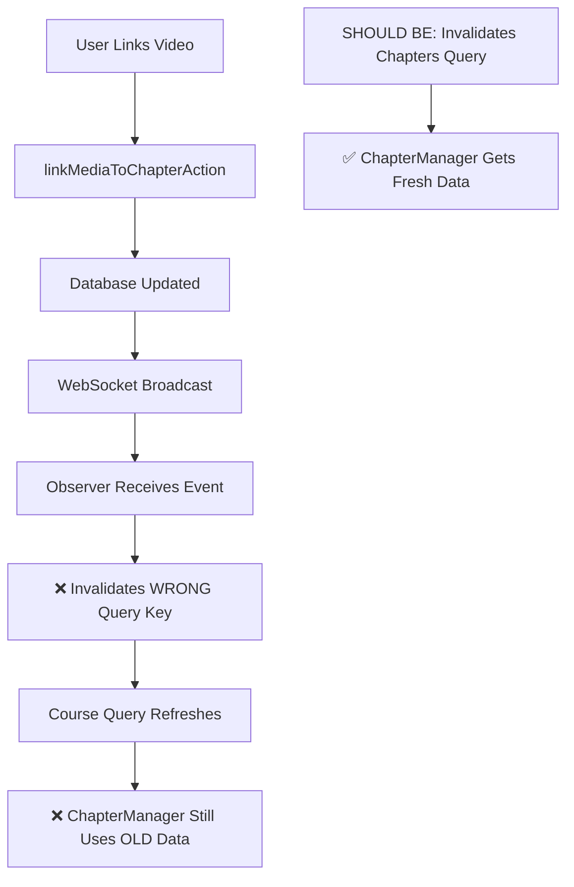

# Media Linking Real-Time Update RCA

**Date:** 2025-09-09  
**Issue:** Videos from media library don't appear in course chapters immediately after linking - page refresh required  
**Status:** Root cause identified, fix pending  

## Executive Summary

The real-time update system is working correctly (WebSocket → Observer → TanStack Query), but the cache invalidation is targeting the wrong query keys. The course edit page uses a separate chapters query that wasn't being invalidated.

## Investigation Timeline

### Phase 1: WebSocket System Analysis ✅
- **Finding:** WebSocket events are being broadcast and received correctly
- **Evidence:** Console logs show successful `media-linked` event flow
- **Status:** Working as expected

### Phase 2: Observer Pattern Analysis ✅  
- **Finding:** Observer is receiving events and emitting to listeners
- **Evidence:** `📡 Observer: Emitting media-linked to 1 listeners`
- **Status:** Working as expected

### Phase 3: Cache Invalidation Analysis ❌
- **Finding:** Wrong query key being invalidated
- **Root Cause Identified:** Invalidating `['courses', 'detail', courseId]` but ChapterManager uses `['chapters', 'list', courseId]`

## Root Cause Analysis

### Architecture Overview
The course edit page has a **split data architecture**:

1. **Course Data:** `useCourseEdit(courseId)` → `['courses', 'detail', courseId]`
   - Queries: `getCourseAction(courseId)` 
   - Returns: Course with embedded videos via JOIN

2. **Chapter Data:** `useChaptersEdit(courseId)` → `['chapters', 'list', courseId]`  
   - Queries: `getChaptersForCourseAction(courseId)`
   - Returns: Chapters with videos via separate query

### The Problem
**ChapterManager** receives data from `useChaptersEdit` but our WebSocket observer only invalidates the course query, not the chapters query.

```typescript
// ❌ Current invalidation (WRONG)
queryClient.invalidateQueries({ queryKey: ['courses', 'detail', variables.courseId] })

// ✅ Should invalidate (CORRECT)
queryClient.invalidateQueries({ queryKey: ['chapters', 'list', variables.courseId] })
```

### Data Flow Analysis



### Evidence

**Console Logs Show:**
1. ✅ Media linking succeeds: `✅ Media linked successfully`
2. ✅ WebSocket event received: `📨 [WEBSOCKET] Message received: media-linked`
3. ✅ Observer emits event: `📡 Observer: Emitting media-linked to 1 listeners`
4. ✅ Cache invalidation triggered: `🔗 [COURSE EDIT] Media linked event received, refreshing course data`
5. ❌ **Wrong query invalidated** - chapters query never refreshes

## Technical Details

### Current WebSocket Observer (BROKEN)
```typescript
// In use-course-queries.ts
useEffect(() => {
  const unsubscribe = courseEventObserver.subscribe(MEDIA_EVENTS.MEDIA_LINKED, (event) => {
    if (event.courseId === courseId) {
      // ❌ This invalidates course query, not chapters query
      queryClient.invalidateQueries({ queryKey: courseKeys.detail(courseId) })
    }
  })
  return unsubscribe
}, [courseId, queryClient])
```

### Query Key Mismatch
- **Course Query:** `['courses', 'detail', courseId]` (gets invalidated ✅)
- **Chapters Query:** `['chapters', 'list', courseId]` (NOT invalidated ❌)

### Data Sources
- **Course Action:** `getCourseAction()` - Missing `video_url`, `media_file_id` fields
- **Chapters Action:** `getChaptersForCourseAction()` - Has all fields via `SELECT '*'`

## Fix Strategy

### Option 1: Move Observer to Chapters Hook ⭐ RECOMMENDED
Move the `media-linked` observer to `useChaptersEdit` hook since that's what ChapterManager actually uses.

### Option 2: Dual Invalidation  
Invalidate both course AND chapters queries from the course observer.

### Option 3: Unify Data Source
Make ChapterManager use course data instead of separate chapters query (larger refactor).

## Implementation Plan

1. **Move Observer** from `use-course-queries.ts` to `use-chapter-queries.ts`
2. **Update Query Key** to `['chapters', 'list', courseId]`
3. **Test Real-Time Updates** work correctly
4. **Verify** no regressions in other parts of the system

## Files Affected
- `/src/hooks/use-course-queries.ts` (remove observer)
- `/src/hooks/use-chapter-queries.ts` (add observer)  

## Testing Checklist
- [ ] Link video from media library
- [ ] Video appears immediately without refresh
- [ ] Multiple videos can be linked
- [ ] Error cases still show proper messages
- [ ] Course info still updates correctly

## Resolution Status
- [x] Root cause identified
- [ ] Fix implemented
- [ ] Testing completed
- [ ] Deployment verified