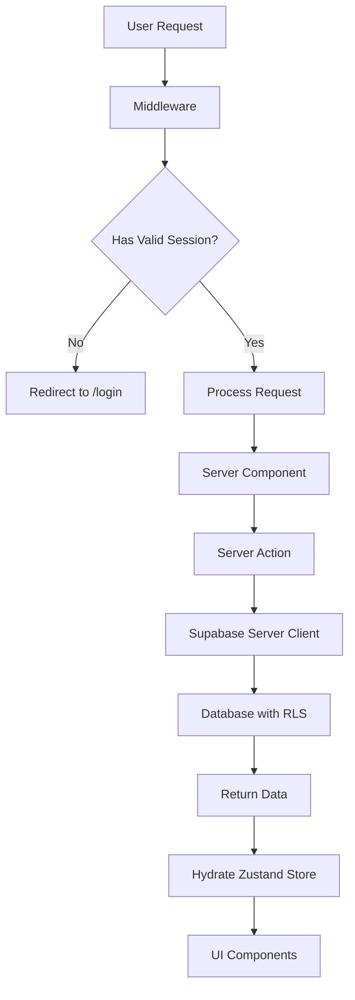

# Server-Side Authentication Pattern

## Architecture Overview

### Core Principles
1. **Server-Side First**: All authentication happens on the server
2. **Zustand as SSOT**: Client state management through Zustand store
3. **httpOnly Cookies**: Secure session management
4. **Server Actions**: Data fetching through server-side functions
5. **Middleware Protection**: Route-level security

## Authentication Flow



## Implementation Layers

### 1. Middleware Layer (`/src/middleware.ts`)
```typescript
// Server-side session validation
const supabase = createServerClient()
const { data: { user } } = await supabase.auth.getUser()

if (isProtectedPath && !user) {
  return NextResponse.redirect('/login')
}
```

### 2. Server Actions (`/src/app/actions/*`)
```typescript
export async function getInstructorCourses() {
  const supabase = await createClient() // Server client
  const { data: { user } } = await supabase.auth.getUser()
  
  if (!user) throw new Error('Unauthorized')
  
  const { data: courses } = await supabase
    .from('courses')
    .select('*')
    .eq('instructor_id', user.id)
  
  return courses
}
```

### 3. API Routes (`/src/app/api/*`)
```typescript
export async function POST(request: NextRequest) {
  // Authenticate using server-side auth
  const authResult = await authenticateApiRequest(request, 'instructor')
  
  if (!authResult.success) {
    return NextResponse.json({ error: 'Unauthorized' }, { status: 401 })
  }
  
  // Process authenticated request
  const supabase = createServiceClient() // Service client for elevated permissions
  // ... rest of logic
}
```

### 4. Zustand Store (`/src/stores/slices/auth-slice.ts`)
```typescript
// NO direct Supabase calls - only hydration from server
initializeAuth: async () => {
  const response = await fetch('/api/auth/session', {
    credentials: 'include' // Include cookies
  })
  const data = await response.json()
  
  if (data.user) {
    get().setUser(data.user)
    get().setProfile(data.profile)
  }
}
```

### 5. Client Components
```typescript
// Components only consume Zustand state
const { user, profile } = useAuthStore()

// NO direct Supabase auth calls
// NO createClient() usage
// Only read from Zustand
```

## Key Files and Responsibilities

| File | Responsibility | Auth Method |
|------|---------------|-------------|
| `/middleware.ts` | Route protection | `createServerClient()` |
| `/app/actions/*` | Data fetching | `createClient()` (server) |
| `/app/api/*` | API endpoints | `authenticateApiRequest()` |
| `/lib/auth/api-auth.ts` | API authentication | `createClient()` (server) |
| `/stores/slices/auth-slice.ts` | State distribution | Hydration from server |
| Client Components | UI rendering | Zustand consumption only |

## Security Features

### 1. httpOnly Cookies
- Session stored in httpOnly cookies
- Not accessible via JavaScript
- Prevents XSS attacks
- Automatically included in requests

### 2. CSRF Protection
- Built into Supabase auth
- Uses secure SameSite cookies
- Double-submit cookie pattern

### 3. Row Level Security (RLS)
- Database-level security
- Policies enforce access control
- Works with server-side auth

### 4. Rate Limiting
```typescript
const rateLimit = checkRateLimit(request, rateLimitConfigs.upload)
if (!rateLimit.allowed) {
  return NextResponse.json(
    { error: 'Rate limit exceeded' },
    { status: 429 }
  )
}
```

## Common Patterns

### Pattern 1: Protected Page
```typescript
// app/instructor/courses/page.tsx
export default async function CoursesPage() {
  // Server component - auth handled by middleware
  const courses = await getInstructorCourses() // Server action
  return <CoursesList courses={courses} />
}
```

### Pattern 2: API with Auth
```typescript
// app/api/upload/route.ts
export async function POST(request) {
  const authResult = await authenticateApiRequest(request, 'instructor')
  if (!authResult.success) return unauthorized()
  
  // Process with authResult.user
}
```

### Pattern 3: Client-Side Navigation
```typescript
// Client component
const { user } = useAuthStore()

if (!user) {
  router.push('/login') // Client-side redirect
}
```

## Migration Checklist

✅ **Completed**
- Middleware authentication
- Auth slice server hydration
- Instructor services
- Course creation/publishing
- Video upload/delete
- API authentication helpers

⏳ **In Progress**
- Student services migration
- Profile management
- Settings pages

## Best Practices

### DO ✅
- Use server actions for data fetching
- Check auth in middleware for pages
- Use `authenticateApiRequest` for APIs
- Store auth state in Zustand
- Include `credentials: 'include'` in fetch

### DON'T ❌
- Call Supabase auth from client components
- Use `createClient()` in client code
- Store sensitive data in localStorage
- Pass auth tokens in query params
- Bypass middleware protection

## Debugging Tips

### Check Auth Flow
1. Verify middleware is running: `console.log('[MIDDLEWARE]', pathname)`
2. Check cookie presence: DevTools > Application > Cookies
3. Verify server action auth: Add logging in actions
4. Monitor Zustand: Redux DevTools extension

### Common Issues

**Issue: 401 Unauthorized in API**
- Solution: Ensure `await createClient()` not `createClient()`
- Check: `credentials: 'include'` in fetch

**Issue: Infinite loading**
- Solution: Check if using client-side `getSession()`
- Fix: Use server-side session API

**Issue: User null in components**
- Solution: Ensure `initializeAuth()` called
- Check: Zustand store hydration

## Enterprise Features Status

| Feature | Status | Implementation |
|---------|--------|---------------|
| Session Management | ✅ Implemented | httpOnly cookies, server validation |
| Rate Limiting | ✅ Implemented | Per-endpoint limits |
| CSRF Protection | ✅ Implemented | SameSite cookies |
| RLS Policies | ✅ Implemented | Database level |
| Audit Logging | ⚠️ Partial | Console logs only |
| MFA | ❌ Not Implemented | Can add Supabase MFA |
| Session Timeout | ⚠️ Basic | Supabase default |
| Device Management | ❌ Not Implemented | Future enhancement |

## Conclusion

Our server-side authentication pattern provides:
- **Security**: httpOnly cookies, CSRF protection
- **Performance**: Server-side rendering
- **Maintainability**: Clear separation of concerns
- **Scalability**: Ready for enterprise features

The pattern follows Next.js 14 best practices and leverages Supabase's built-in security features while maintaining a clean architecture with Zustand for state management.