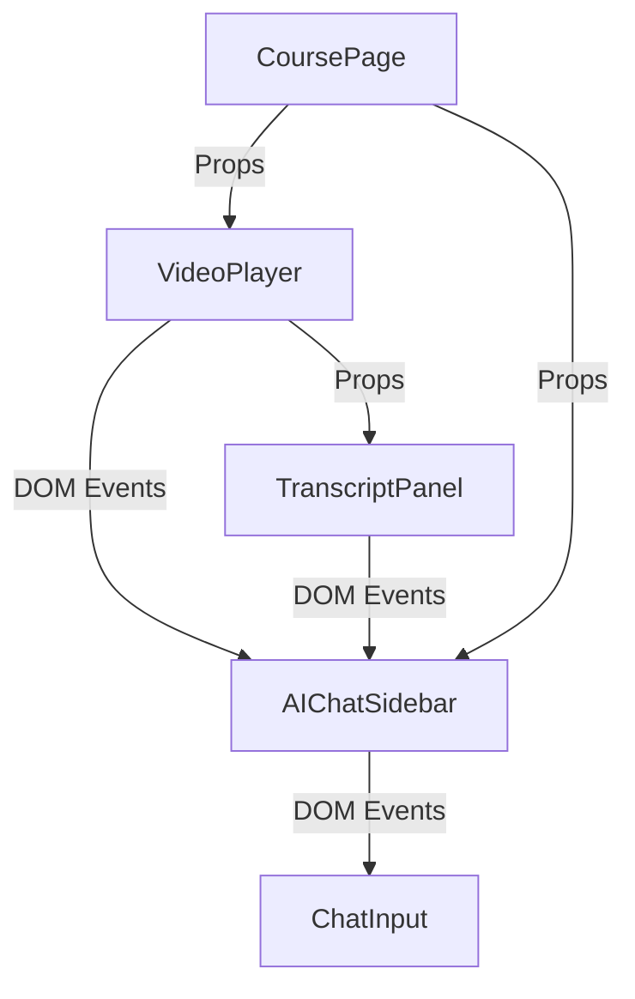

# Unpuzzle MVP Codebase Improvement Plan
## Comprehensive Analysis & Refactoring Strategy

*Generated: 2025-08-06*

---

## 🎯 Executive Summary

The Unpuzzle MVP demonstrates strong foundational architecture with modern technologies but suffers from critical state management issues that will severely limit scalability. This document outlines a comprehensive refactoring strategy to transform the current prototype into a production-ready, feature-rich learning platform.

**Key Issues**: State management chaos, component coupling, event-driven anti-patterns, and architectural debt.

**Solution**: Phased refactoring approach focusing on state management foundation, component decomposition, and clean architecture patterns.

---

## 🏗️ Current Architecture Analysis

### Strengths ✅
- **Modern Stack**: Next.js 15, React 19, TypeScript, Tailwind CSS
- **Component Structure**: Well-organized component hierarchy
- **Type Safety**: Comprehensive TypeScript interfaces
- **Design System**: Consistent shadcn/ui components
- **Feature Completeness**: Rich video player with AI integration

### Critical Weaknesses ❌
- **No State Management**: Pure React state leading to prop drilling nightmare
- **Event-Driven Anti-patterns**: DOM events for component communication
- **Monolithic Components**: 800+ line components with mixed responsibilities
- **Data Coupling**: Components directly coupled to mock data structures
- **Performance Issues**: No optimization strategies implemented

---

## 🚨 Critical State Management Issues

### 1. Prop Drilling Hell
```typescript
// Current: Data passed through 4+ component levels
VideoPage → VideoPlayer → TranscriptPanel → AIChat
  ↓           ↓             ↓              ↓
currentTime  currentTime   currentTime    currentTime
userProfile  userProfile   userProfile    userProfile
courseData   courseData    courseData     courseData
```

### 2. State Duplication Crisis
- **Video State**: Replicated in VideoPlayer, AIChatSidebar, course page
- **User Progress**: Maintained separately in dashboard, sidebar, cards
- **AI Interactions**: Scattered across multiple components
- **Course Data**: Duplicated in course cards, navigation, video player

### 3. Event System Anti-Pattern
```typescript
// PROBLEMATIC: Global DOM events everywhere
window.dispatchEvent(new CustomEvent('clipSelected', { detail: data }))
window.addEventListener('sendToAIChat', handler)
window.addEventListener('addTranscriptReference', handler)

// Result: Debugging nightmare, memory leaks, tight coupling
```

### 4. Component Coupling Disaster


---

## 📁 Component Organization Problems

### Monolithic Components
| Component | Lines | Responsibilities | Issues |
|-----------|-------|------------------|---------|
| VideoPlayer | 870 | Video playback, transcript, AI, clipboard | Too many concerns |
| AIChatSidebar | 360 | Chat, AI responses, references, actions | Mixed responsibilities |
| AICourseCard | 200 | Display, progress, AI metrics | Data coupling |

### Missing Abstractions
- ❌ No data access layer
- ❌ No service layer for AI operations
- ❌ No centralized API communication
- ❌ No reusable business logic hooks
- ❌ No error boundary strategy

---

## 💾 Data Management Issues

### Hardcoded Dependencies
```typescript
// PROBLEM: Hardcoded data in components
const transcriptSegments = [
  { start: 0, end: 5, text: "Welcome to this..." },
  { start: 5, end: 10, text: "In this course..." },
  // ... 20+ more hardcoded segments IN COMPONENT
]

// PROBLEM: Mock data directly imported
import { mockCourses, mockUsers } from "@/data/mock"
```

### Inconsistent Data Flow
- Mixed use of props, context, and global events
- No consistent pattern for data fetching
- Ad-hoc state updates
- No data validation or transformation layer

---

## 🎭 Performance & Scalability Concerns

### Performance Issues
- **No Virtualization**: Lists will break with 100+ items
- **Heavy Re-renders**: Missing React.memo and optimization
- **Memory Leaks**: Event listeners not cleaned up
- **Bundle Size**: No code splitting implemented

### Scalability Limitations
- Adding new AI agents requires modifying 5+ files
- New metrics need updates across dashboard, sidebar, course cards
- Video features require changes in player, chat, course pages
- No caching strategy for user data or course progress

---

## 🛠️ Refactoring Strategy

## Phase 1: State Management Foundation (Priority: 🚨 Critical)

### 1.1 Implement Zustand State Management
```typescript
// Global app state structure
interface AppStore {
  // User Management
  user: UserProfile | null
  setUser: (user: UserProfile) => void
  updateUserProgress: (progress: UserProgress) => void
  
  // Course Management  
  courses: Course[]
  currentCourse: Course | null
  setCourses: (courses: Course[]) => void
  setCurrentCourse: (course: Course) => void
  
  // Video State
  video: {
    currentTime: number
    duration: number
    isPlaying: boolean
    inPoint: number | null
    outPoint: number | null
    selectedTranscript: SelectedText | null
  }
  updateVideoTime: (time: number) => void
  setInOutPoints: (inPoint: number, outPoint: number) => void
  
  // AI Interactions
  ai: {
    chatHistory: ChatMessage[]
    transcriptReferences: TranscriptReference[]
    activeAgents: AIAgent[]
    metrics: AIMetrics
  }
  addChatMessage: (message: ChatMessage) => void
  addTranscriptReference: (ref: TranscriptReference) => void
}
```

### 1.2 Create Service Layer
```typescript
// AI Service abstraction
interface AIService {
  generateHint(context: VideoContext): Promise<AIHint>
  createQuiz(segment: VideoSegment): Promise<AIQuiz>
  analyzeProgress(progress: UserProgress): Promise<LearningInsights>
  processTranscriptQuery(text: string, context: VideoContext): Promise<AIResponse>
}

// Video Service abstraction
interface VideoService {
  loadVideoMetadata(url: string): Promise<VideoMetadata>
  processTranscript(videoId: string): Promise<TranscriptSegment[]>
  recordProgress(userId: string, videoId: string, progress: VideoProgress): Promise<void>
}

// Course Service abstraction
interface CourseService {
  getCourses(filters?: CourseFilters): Promise<Course[]>
  getCourseDetails(id: string): Promise<CourseDetails>
  enrollUser(userId: string, courseId: string): Promise<void>
  trackMetrics(userId: string, metrics: LearningMetrics): Promise<void>
}
```

### 1.3 Replace Event System
```typescript
// BEFORE: Event-driven chaos
window.dispatchEvent(new CustomEvent('clipSelected', { detail: data }))

// AFTER: Clean state management
const { setInOutPoints, addTranscriptReference } = useAppStore()
const handleClipSelection = (start: number, end: number, text: string) => {
  setInOutPoints(start, end)
  addTranscriptReference({ text, startTime: start, endTime: end })
}
```

## Phase 2: Component Decomposition (Priority: 🔥 High)

### 2.1 Break Down VideoPlayer
```typescript
// Split monolithic VideoPlayer into focused components

// Core playback engine
const VideoEngine = () => {
  const { currentTime, isPlaying, updateVideoTime } = useVideoStore()
  // Pure video playback logic
}

// Control interface
const VideoControls = () => {
  const { play, pause, seek, setVolume } = useVideoStore()
  // Playback controls only
}

// Transcript management
const TranscriptPanel = () => {
  const { transcript, currentTime, selectedText } = useVideoStore()
  // Transcript display and selection
}

// AI integration
const AIInteractionPanel = () => {
  const { aiState, addInteraction } = useAppStore()
  // AI chat and interactions
}

// Composed video player
const VideoPlayer = ({ videoUrl }: { videoUrl: string }) => (
  <VideoPlayerProvider videoUrl={videoUrl}>
    <div className="video-player">
      <VideoEngine />
      <VideoControls />
      <TranscriptPanel />
      <AIInteractionPanel />
    </div>
  </VideoPlayerProvider>
)
```

### 2.2 Create Custom Hooks
```typescript
// Reusable business logic
const useVideoPlayer = (videoUrl: string) => {
  const store = useAppStore()
  // Video-specific logic and state management
  return {
    currentTime: store.video.currentTime,
    play: () => store.playVideo(),
    pause: () => store.pauseVideo(),
    seek: (time: number) => store.seekTo(time)
  }
}

const useAIChat = (context: VideoContext) => {
  const { ai, addChatMessage, addTranscriptReference } = useAppStore()
  // AI interaction logic
  return {
    messages: ai.chatHistory,
    sendMessage: (message: string) => addChatMessage(message, context),
    addReference: (text: string) => addTranscriptReference(text, context)
  }
}

const useTranscriptSelection = () => {
  const { video, setInOutPoints } = useAppStore()
  // Transcript selection logic with proper timing calculation
  return {
    selectedText: video.selectedTranscript,
    selectRange: (start: number, end: number, text: string) => {
      setInOutPoints(start, end)
      // Clean state-based selection
    }
  }
}
```

## Phase 3: Clean Architecture (Priority: 🔥 High)

### 3.1 Data Access Layer
```typescript
// Abstract data access
class DataRepository {
  static async getCourses(): Promise<Course[]> {
    // Later: Replace with API calls
    return mockCourses
  }
  
  static async getUserProgress(userId: string): Promise<UserProgress> {
    // Centralized data access
  }
  
  static async saveVideoProgress(progress: VideoProgress): Promise<void> {
    // Consistent data persistence
  }
}
```

### 3.2 Error Handling Strategy
```typescript
// Global error boundary
const AppErrorBoundary = ({ children }: { children: React.ReactNode }) => (
  <ErrorBoundary
    FallbackComponent={ErrorFallback}
    onError={logErrorToService}
  >
    {children}
  </ErrorBoundary>
)

// Hook for error handling
const useErrorHandler = () => {
  const showError = (error: Error, context?: string) => {
    logError(error, context)
    toast.error(error.message)
  }
  return { showError }
}
```

## Phase 4: Performance Optimization (Priority: 🔶 Medium)

### 4.1 React Optimizations
```typescript
// Memoized components
const CourseCard = React.memo(({ course }: { course: Course }) => {
  // Expensive course card rendering
})

// Optimized hooks
const useVideoMetrics = (courseId: string) => {
  return useMemo(() => {
    // Expensive calculation
  }, [courseId])
}

const useAIInteractions = (videoId: string) => {
  return useCallback((interaction: AIInteraction) => {
    // Optimized interaction handler
  }, [videoId])
}
```

### 4.2 Code Splitting & Lazy Loading
```typescript
// Lazy load heavy components
const VideoPlayer = lazy(() => import('./VideoPlayer'))
const AIDashboard = lazy(() => import('./AIDashboard'))

// Route-based code splitting implemented
const DynamicVideoPage = dynamic(() => import('./pages/video/[videoId]'))
```

---

## 📋 Implementation Timeline

### Week 1-2: Foundation (Critical Path)
- [ ] Implement Zustand state management
- [ ] Create core store structure
- [ ] Remove DOM event system
- [ ] Basic service layer setup

### Week 3-4: Component Refactoring
- [ ] Break down VideoPlayer component
- [ ] Extract custom hooks
- [ ] Implement proper prop patterns
- [ ] Clean up component responsibilities

### Week 5-6: Architecture Cleanup
- [ ] Implement data access layer
- [ ] Add error handling strategy
- [ ] Create reusable business logic
- [ ] Add proper TypeScript interfaces

### Week 7-8: Performance & Polish
- [ ] Add React optimizations
- [ ] Implement code splitting
- [ ] Add loading states
- [ ] Performance profiling and fixes

### Week 9-10: Testing & Documentation
- [ ] Unit tests for hooks and services
- [ ] Integration tests for core flows
- [ ] Component testing strategy
- [ ] API documentation

---

## 🎯 Success Metrics

### Before Refactoring (Current Issues)
- 🚨 870-line VideoPlayer component
- 🚨 DOM event-based communication
- 🚨 State scattered across 10+ locations
- 🚨 No reusable business logic
- 🚨 Tight coupling between all components

### After Refactoring (Target Goals)
- ✅ Components under 200 lines each
- ✅ Centralized state management
- ✅ 0 global DOM events
- ✅ Reusable hooks and services
- ✅ Loose coupling with clean interfaces
- ✅ 90%+ test coverage on business logic
- ✅ Performance budget under 3s TTI

---

## 🚀 Long-term Scalability Benefits

### Easy Feature Addition
```typescript
// Adding new AI agent type becomes trivial
const NewAIAgent = () => {
  const { addAIAgent, context } = useAIStore()
  // Single location for new agent logic
}

// Adding new video features is isolated
const useVideoFeature = () => {
  const { video, updateVideo } = useAppStore()
  // Clean, testable feature logic
}
```

### Clean Extension Points
- **Plugin Architecture**: AI agents as pluggable modules
- **Theme System**: Centralized design tokens
- **API Integration**: Service layer ready for backend
- **Analytics**: Event tracking without component changes
- **A/B Testing**: Feature flags built into state management

### Developer Experience
- **Fast Development**: Reusable hooks and components
- **Easy Debugging**: Centralized state with dev tools
- **Predictable Code**: Consistent patterns and practices
- **Simple Testing**: Isolated business logic
- **Clear Documentation**: Well-defined interfaces and contracts

---

## 📝 Action Plan Summary

1. **Immediate (This Week)**: Start with Zustand implementation
2. **Critical Path**: Remove DOM events and implement proper state flow
3. **Component Focus**: Break down VideoPlayer into manageable pieces
4. **Service Layer**: Abstract AI and data operations
5. **Performance**: Add optimizations as you go
6. **Testing**: Build tests alongside refactoring

The current codebase has solid foundations but needs architectural intervention to become production-ready. The proposed refactoring will transform it into a scalable, maintainable platform ready for long-term feature development.

**Priority Order**: State Management → Component Decomposition → Service Layer → Performance → Testing

This refactoring will set the foundation for a world-class AI-powered learning platform. 🚀